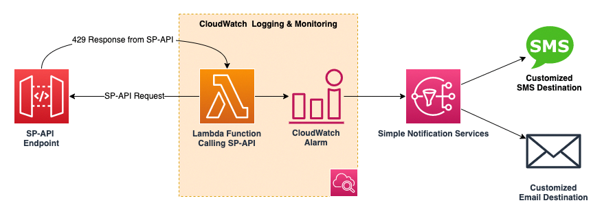

# SP-API-Throttling-Monitor

## Background
API reliability depends on sizing your capacity and resources to meet the changing needs of applications over time. This means attempting to understand and forecast usage, and then managing the frequency of requests to protect against overwhelming the service at peak usage times. In the Selling Partner API, requests are rate limited using the token bucket algorithm. When request submissions exceed the steady-state request rate and burst limits, SP-API fails the limit-exceeding requests and returns “429 Too Many Requests" error responses to the client. To better understand our API call and increase the reliability of the SP-API application and reduce operation, we build this project tracing the 429 error with CloudWatch.


## Introduction

This project includes a CloudFormation template, which will launch a Lambda Function calling the Selling Partner API Endpoint.The CloudFormation includes the provision step of a Lambda calling SP-API, the related IAM role, the log groups for this Lambda and the CloudWatch custom metrics and alarm to trace the 429 Error and the SNS to send notifications to the specific email group. 
This project also includes a helper script which will invoke the Lambda to call SP-API in a high frequency.



```.
├── GUIDE.md     ----- User Guide
├── README.md       ----- Project README
├── lambda-function      ----- Lambda Function for SP-API call
│   ├── lambda_function.py      ---- Lambda Function Code        
│   └── requirements.txt        ----- Dependencies
├── static      ----- Static Files
└── templates        
    ├── 429-template.yaml        ---- CloudFormation for whole Infra  
    └── lambda_invoker.py     ---- Helper Script for invoke the Lambda to meet throttle

```

## License

This library is licensed under the MIT-0 License. See the LICENSE file.

